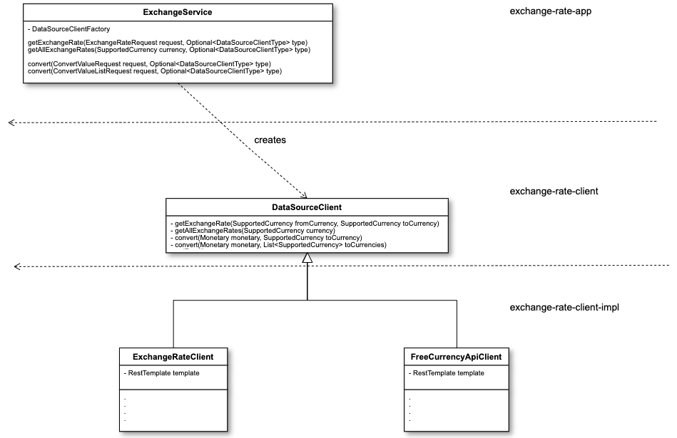

# **BetVictor Exchange Rate Challenge**

## **DESIGN DECISIONS**

## **Basic Model Class Diagram**

### **DataSource Clients**

* The Application integrates with the clients using the abstractions of exchange-rate-client
  and Configuration. There is no direct reference of Client Implementations for loosely coupling.

* The coupling point of application with client implementations is by scanning any components
  found under client-impl module. Therefore, if you wish to add a new client implementation,
  two steps are required:
  * Make it a _Component_ (to be scanned by spring)
  * Declare its type in _DataSourceClientType_ numeration. That enumeration is also used for configuration of the default client implementation

* In All Operations, the client implementation can be controlled by passing **x-datasource-provider** header to the request. The header receives values from _DataSourceClientType_ enum. If nothing is passed, the application uses the default client type configured via property **default.application.datasource-provider**.

### **CACHE**

* Hazelcast was selected as a _call-reduction layer_ against the DataSources to cache responses.
  The in-memory data-grid of Hazelcast will have at least 1 backup (replication) across other nodes
  so even values fetched by node A will be accessible by node B even if traffic goes through B.

* Retention period is configured in hazelcast.xml on each cache and affects how often
  the APIs might be called to fetch data (_**see**_ _time-to-live-seconds_)

### **ASYNC API**

1. The implementation of async api is implemented using a RabbitMQ. Event _ExchangeOperationRequest_ is published by all async operations to a configurable queue (exchange-operation-request).
2. Each application node has a consumer that listens for these events and asynchronously will process them one by one.
3. All async operations receive a mandatory callback url which will be called before the successful processing of the event finished to communicate the results to the client.
4. If the event processing happens after 60s, the event is **discarded**.
5. **application.async-api.enabled** controls the feature. If false, the application **does not** require RabbitMQ as dependency.

## **RUN PROJECT**

To Run the Project, you can use the following options:

* i) Using the IDEA Runner, run _Main_ class of exchange-rate-app 
* _ExampleClientMain_ for exhange-rate-app-client-example,
  the application that simulates the user for asynchronous callbacks (when **application.async-api.enabled** is set to true)

* ii) mvn spring-boot:run can be used inside exchange-rate-app.

* iii) java -jar ./target/exchange-rate-app-0.0.1-SNAPSHOT.jar in exchange-rate-app Directory

* iv) **Async-api Prerequisite**: Run RabbitMQ Docker Command:
    `docker run -it --rm --name rabbitmq -p 5672:5672 -p 15672:15672 rabbitmq:3.9-management`

* The application swagger API can be found at http://localhost:8080/swagger-ui/index.html
* The application simulating the client swagger API can be found at http://localhost:9080/swagger-ui/index.html
* RabbitMQ Management can be monitored at http://localhost:15672/ using guest:guest